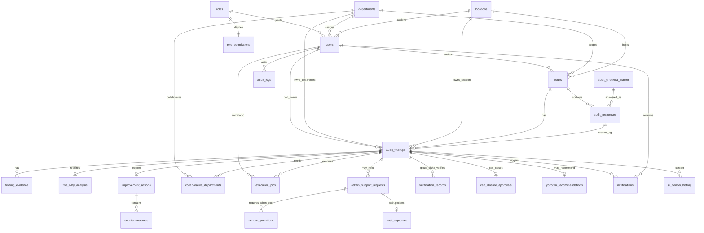

# Drive Pulse - DISHA HSC Database Architecture

Backend-only architecture for Supabase/PostgreSQL. This follows the finalized governance rules and the current DISHA HSC workflow. No frontend scope is included.

## 1. ERD

## 2. Table List

Required tables implemented in `supabase/migrations/202606180001_drive_pulse_schema.sql`:

1. `locations`
2. `departments`
3. `roles`
4. `users`
5. `role_permissions`
6. `audit_checklist_master`
7. `audits`
8. `audit_responses`
9. `audit_findings`
10. `finding_evidence`
11. `improvement_actions`
12. `five_why_analysis`
13. `countermeasures`
14. `collaborative_departments`
15. `execution_pics`
16. `admin_support_requests`
17. `vendor_quotations`
18. `cost_approvals`
19. `verification_records`
20. `ceo_closure_approvals`
21. `yokoten_recommendations`
22. `notifications`
23. `audit_logs`
24. `ai_sensei_history`

## 3. Columns, Primary Keys, and Foreign Keys

### `locations`
Primary key: `id`

Columns: `id`, `code`, `name`, `type`, `visibility`, `created_at`, `updated_at`

Unique keys: `(code, name)`

### `departments`
Primary key: `id`

Columns: `id`, `name`, `status`, `created_at`, `updated_at`

Unique keys: `name`

### `roles`
Primary key: `id`

Columns: `id`, `name`, `scope`, `status`, `created_at`, `updated_at`

Unique keys: `name`

Governed roles: CEO, VP, DISHA HSC PIC, Branch DISHA PIC, Location Functional HOD, Group Functional HOD, Auditor, PIC, Viewer, Admin.

### `users`
Primary key: `id`

Columns: `id`, `full_name`, `mobile_number`, `email`, `role_id`, `location_id`, `department_id`, `is_active`, `created_at`, `updated_at`

Foreign keys: `id -> auth.users(id)`, `role_id -> roles(id)`, `location_id -> locations(id)`, `department_id -> departments(id)`

Unique keys: `mobile_number`, `email`

Rule: mobile number is the unique login identifier. Employee ID is intentionally not included in V1.

### `role_permissions`
Primary key: `id`

Columns: `id`, `role_id`, `can_view`, `can_add`, `can_edit`, `can_delete`, `can_approve`, `can_verify`, `can_close`, `can_export`, `ai_access`, `created_at`, `updated_at`

Foreign keys: `role_id -> roles(id)`

Unique keys: `role_id`

### `audit_checklist_master`
Primary key: `id`

Columns: `id`, `checklist_code`, `version`, `section`, `area`, `chapter`, `classification`, `location_aspect`, `evaluation_question`, `evaluation_parameter`, `guest_experience_impact`, `risk_level`, `facility_type`, `question`, `purpose`, `checking_method`, `additional_info`, `sop_reference`, `evidence_required`, `department_owner_id`, `status`, `effective_from`, `effective_to`, `created_by`, `created_at`, `updated_at`

Foreign keys: `department_owner_id -> departments(id)`, `created_by -> users(id)`

Unique keys: `(checklist_code, version)`

Rule: `risk_level` is a generated column. `Direct` guest impact derives `Critical`; `Indirect` guest impact derives `Medium`. Weightage is intentionally excluded.

### `audits`
Primary key: `id`

Columns: `id`, `audit_no`, `title`, `location_id`, `department_id`, `auditor_id`, `scheduled_date`, `started_at`, `submitted_at`, `completed_at`, `status`, `score`, `created_by`, `created_at`, `updated_at`

Foreign keys: `location_id -> locations(id)`, `department_id -> departments(id)`, `auditor_id -> users(id)`, `created_by -> users(id)`

Unique keys: `audit_no`

Rule: Branch DISHA PIC acts as auditor.

### `audit_responses`
Primary key: `id`

Columns: `id`, `audit_id`, `checklist_id`, `result`, `observation`, `comments`, `responded_by`, `responded_at`, `created_at`, `updated_at`

Foreign keys: `audit_id -> audits(id)`, `checklist_id -> audit_checklist_master(id)`, `responded_by -> users(id)`

Unique keys: `(audit_id, checklist_id)`

Rule: `NG` requires an observation.

### `audit_findings`
Primary key: `id`

Columns: `id`, `finding_no`, `audit_response_id`, `audit_id`, `checklist_id`, `location_id`, `owner_department_id`, `location_functional_hod_id`, `current_condition`, `gap_identified`, `auditor_comments`, `risk_level`, `status`, `target_date`, `hod_submitted_at`, `verified_at`, `closed_at`, `created_by`, `created_at`, `updated_at`

Foreign keys: `audit_response_id -> audit_responses(id)`, `audit_id -> audits(id)`, `checklist_id -> audit_checklist_master(id)`, `location_id -> locations(id)`, `owner_department_id -> departments(id)`, `location_functional_hod_id -> users(id)`, `created_by -> users(id)`

Unique keys: `finding_no`, `audit_response_id`

Rule: NG findings are created from `audit_responses`. Location Functional HOD must be resolvable at creation time and owns improvement closure.

### `finding_evidence`
Primary key: `id`

Columns: `id`, `finding_id`, `storage_bucket`, `storage_path`, `file_name`, `mime_type`, `file_size_bytes`, `evidence_stage`, `uploaded_by`, `uploaded_at`, `is_deleted`

Foreign keys: `finding_id -> audit_findings(id)`, `uploaded_by -> users(id)`

Unique keys: `(storage_bucket, storage_path)`

### `five_why_analysis`
Primary key: `id`

Columns: `id`, `finding_id`, `why_1`, `why_2`, `why_3`, `why_4`, `why_5`, `root_cause`, `prepared_by`, `prepared_at`, `updated_at`

Foreign keys: `finding_id -> audit_findings(id)`, `prepared_by -> users(id)`

Unique keys: `finding_id`

Rule: root cause is mandatory for every NG before execution/submission can proceed.

### `improvement_actions`
Primary key: `id`

Columns: `id`, `finding_id`, `action_plan`, `expected_result`, `target_completion_date`, `cost_involved`, `estimated_cost`, `status`, `created_by`, `created_at`, `updated_at`

Foreign keys: `finding_id -> audit_findings(id)`, `created_by -> users(id)`

Unique keys: `finding_id`

Rule: improvement action is mandatory for every NG before execution/submission can proceed.

### `countermeasures`
Primary key: `id`

Columns: `id`, `finding_id`, `improvement_action_id`, `type`, `description`, `responsible_user_id`, `due_date`, `status`, `completed_at`, `created_by`, `created_at`, `updated_at`

Foreign keys: `finding_id -> audit_findings(id)`, `improvement_action_id -> improvement_actions(id)`, `responsible_user_id -> users(id)`, `created_by -> users(id)`

### `collaborative_departments`
Primary key: `id`

Columns: `id`, `finding_id`, `department_id`, `nominated_by`, `created_at`

Foreign keys: `finding_id -> audit_findings(id)`, `department_id -> departments(id)`, `nominated_by -> users(id)`

Unique keys: `(finding_id, department_id)`

### `execution_pics`
Primary key: `id`

Columns: `id`, `finding_id`, `user_id`, `nominated_by`, `responsibility`, `is_primary`, `created_at`

Foreign keys: `finding_id -> audit_findings(id)`, `user_id -> users(id)`, `nominated_by -> users(id)`

Unique keys: `(finding_id, user_id)`. Partial unique key ensures one primary execution PIC per finding.

### `admin_support_requests`
Primary key: `id`

Columns: `id`, `finding_id`, `requested_by`, `support_type`, `description`, `cost_involved`, `estimated_cost`, `status`, `admin_owner_id`, `requested_at`, `decided_at`, `created_at`, `updated_at`

Foreign keys: `finding_id -> audit_findings(id)`, `requested_by -> users(id)`, `admin_owner_id -> users(id)`

Rule: Admin supports material, repair, and vendor requirements.

### `vendor_quotations`
Primary key: `id`

Columns: `id`, `admin_support_request_id`, `vendor_name`, `vendor_contact`, `quotation_amount`, `currency`, `quotation_storage_path`, `received_at`, `is_selected`, `selection_reason`, `created_by`, `created_at`, `updated_at`

Foreign keys: `admin_support_request_id -> admin_support_requests(id)`, `created_by -> users(id)`

Rule: if cost is involved, at least 3 quotations are required before CEO cost approval.

### `cost_approvals`
Primary key: `id`

Columns: `id`, `admin_support_request_id`, `finding_id`, `ceo_id`, `decision`, `comments`, `decided_at`, `created_at`, `updated_at`

Foreign keys: `admin_support_request_id -> admin_support_requests(id)`, `finding_id -> audit_findings(id)`, `ceo_id -> users(id)`

Unique keys: `admin_support_request_id`

Rule: CEO is the final approver for cost.

### `verification_records`
Primary key: `id`

Columns: `id`, `finding_id`, `verified_by`, `decision`, `comments`, `evidence_review`, `verified_at`, `created_at`

Foreign keys: `finding_id -> audit_findings(id)`, `verified_by -> users(id)`

Rule: Group DISHA HSC PIC verifies completed solution before CEO closure.

### `ceo_closure_approvals`
Primary key: `id`

Columns: `id`, `finding_id`, `ceo_id`, `decision`, `comments`, `decided_at`, `created_at`, `updated_at`

Foreign keys: `finding_id -> audit_findings(id)`, `ceo_id -> users(id)`

Unique keys: `finding_id`

Rule: CEO is final approver for closure.

### `yokoten_recommendations`
Primary key: `id`

Columns: `id`, `finding_id`, `recommended_by`, `recommendation_reason`, `criticality_notes`, `ceo_id`, `status`, `ceo_comments`, `decided_at`, `shared_at`, `created_at`, `updated_at`

Foreign keys: `finding_id -> audit_findings(id)`, `recommended_by -> users(id)`, `ceo_id -> users(id)`

Unique keys: `finding_id`

Rule: Yokoten is subjective. Group DISHA HSC PIC recommends based on criticality; CEO approves if required.

### `notifications`
Primary key: `id`

Columns: `id`, `recipient_user_id`, `finding_id`, `audit_id`, `notification_type`, `title`, `body`, `channel`, `status`, `escalation_level`, `due_at`, `sent_at`, `read_at`, `created_at`

Foreign keys: `recipient_user_id -> users(id)`, `finding_id -> audit_findings(id)`, `audit_id -> audits(id)`

### `audit_logs`
Primary key: `id`

Columns: `id`, `actor_user_id`, `action`, `table_name`, `record_id`, `old_data`, `new_data`, `ip_address`, `user_agent`, `created_at`

Foreign keys: `actor_user_id -> users(id)`

### `ai_sensei_history`
Primary key: `id`

Columns: `id`, `finding_id`, `user_id`, `use_case`, `prompt`, `response`, `final_decision`, `ai_suggestion_useful`, `usefulness_rating`, `final_action_changed_by_human`, `created_at`

Foreign keys: `finding_id -> audit_findings(id)`, `user_id -> users(id)`

Rule: AI Sensei can assist, but cannot approve cost, verify closure, approve closure, or decide Yokoten.

## 6. Status Workflow

Audit statuses:

1. `draft`
2. `scheduled`
3. `in_progress`
4. `submitted`
5. `completed`
6. `cancelled`

NG finding statuses:

1. `open` - NG created from audit response.
2. `assigned_to_hod` - Location Functional HOD assigned.
3. `root_cause_pending` - 5 Why expected.
4. `action_plan_pending` - improvement action expected.
5. `execution_pending` - collaborative departments and execution PIC nominated.
6. `admin_support_pending` - material, repair, or vendor help required.
7. `cost_approval_pending` - cost involved and CEO approval required.
8. `implementation_in_progress` - execution PIC performs approved action.
9. `hod_submission_pending` - Location Functional HOD submits completed solution.
10. `verification_pending` - Group DISHA HSC PIC verifies.
11. `verification_rejected` - returned to Location Functional HOD with comments.
12. `ceo_closure_pending` - accepted by Group DISHA HSC PIC and sent to CEO.
13. `closed` - CEO approved final closure.
14. `cancelled` - invalid or withdrawn with governance authority.

Database guardrails:

- `NG` audit response requires observation.
- `risk_level` is derived from `guest_experience_impact`.
- Root cause, improvement action, and primary execution PIC are required before execution/submission stages.
- CEO closure cannot be requested until Group DISHA HSC PIC has accepted verification.

## 7. Approval Workflow

Cost approval:

1. Location Functional HOD creates improvement action.
2. Location Functional HOD requests Admin support if material, repair, or vendor help is needed.
3. Admin collects quotations when cost is involved.
4. Minimum 3 quotations must exist before request moves to CEO cost approval.
5. CEO approves or rejects cost in `cost_approvals`.
6. Rejection requires comments.

Closure approval:

1. Location Functional HOD submits completed solution.
2. Group DISHA HSC PIC verifies in `verification_records`.
3. If rejected, finding returns to Location Functional HOD with comments.
4. If accepted, CEO closure approval is created.
5. CEO approves final closure in `ceo_closure_approvals`.
6. Rejection requires comments.

Yokoten approval:

1. Group DISHA HSC PIC may recommend Yokoten in `yokoten_recommendations`.
2. Recommendation is subjective and based on criticality.
3. CEO approves or rejects Yokoten.
4. Approved Yokoten can be marked `shared`.

## 8. Escalation Triggers

Recommended scheduled Supabase Edge Function or cron job, running daily:

- Critical finding created: notify Group Functional HOD, DISHA HSC PIC, and CEO immediately.
- Overdue by 0 days: notify Location Functional HOD and execution PIC.
- Overdue by 7 days: notify Group Functional HOD.
- Overdue by 15 days: notify CEO.
- Cost approval pending over 2 business days: remind CEO and Admin.
- Verification pending over 3 business days: remind Group DISHA HSC PIC.
- CEO closure pending over 3 business days: remind CEO.

Escalation data lands in `notifications` with `notification_type = 'escalation'` and a non-zero `escalation_level`.

## 9. Notification Triggers

Implemented trigger plan:

- Finding status changes create notifications for the HOD, auditor/creator, execution PIC, CEO when CEO action is needed, and DISHA HSC PIC when verification is needed.

Recommended additional triggers:

- NG finding created: notify Location Functional HOD and DISHA HSC PIC.
- HOD assigned: notify assigned HOD.
- Execution PIC nominated: notify PIC.
- Admin support requested: notify Admin.
- Third quotation uploaded: notify Admin to submit to CEO.
- CEO cost rejected: notify Location Functional HOD and Admin with comments.
- HOD solution submitted: notify Group DISHA HSC PIC.
- Verification rejected: notify Location Functional HOD with comments.
- Verification accepted: notify CEO for closure.
- CEO closure approved: notify Location Functional HOD, auditor, DISHA HSC PIC, and execution PIC.
- Yokoten recommended: notify CEO.
- Yokoten approved: notify DISHA HSC PIC.

## 10. Supabase Row Level Security Strategy

RLS is enabled on every table.

Role strategy:

- `CEO`: global read visibility, cost approval, closure approval, Yokoten approval.
- `VP`: global read visibility and reporting visibility.
- `DISHA HSC PIC`: governance administrator, checklist control, verification, closure routing, Yokoten recommendation.
- `Branch DISHA PIC`: audit creation/conducting role; acts as auditor.
- `Location Functional HOD`: owns RCA, action plan, collaborative departments, execution PIC nomination, and improvement submission for assigned findings.
- `Group Functional HOD`: escalation/read visibility for relevant critical or overdue findings.
- `Admin`: support requests, vendor quotations, and cost package preparation.
- `PIC`: execution-level access to assigned action items only.
- `Viewer`: read-only access where explicitly allowed.

Access strategy:

- Master data is readable to active authenticated users and managed by DISHA HSC PIC.
- User profiles are self-readable; governance roles can read user directories.
- Audits are visible by assigned auditor, same-location users, and global governance roles.
- Findings are visible to participants: auditor, assigned Location Functional HOD, execution PIC, same location/department owners, and governance roles.
- Root cause and improvement action writes are limited to the assigned Location Functional HOD.
- Verification writes are limited to DISHA HSC PIC.
- Cost and closure approval writes are limited to CEO.
- Notifications are visible only to their recipient.
- Audit logs are readable only by governance roles.
- AI history can be created only by users whose role permission has `ai_access = true`.

Storage strategy:

- Evidence files should use a Supabase Storage bucket named `finding-evidence`.
- File metadata is stored in `finding_evidence`.
- Storage policies should mirror `finding_evidence` RLS: participants can upload/read; DISHA HSC PIC controls deletion.

## Supabase SQL Plan

Migration file: `supabase/migrations/202606180001_drive_pulse_schema.sql`

Execution order:

1. Create enums and extensions.
2. Create master tables: locations, departments, roles, users, permissions.
3. Create audit/checklist tables.
4. Create NG lifecycle tables.
5. Create admin, quotation, approval, verification, closure, Yokoten tables.
6. Create notification, audit log, and AI history tables.
7. Create indexes.
8. Create trigger functions.
9. Attach triggers.
10. Enable RLS.
11. Create RLS policies.

Seed data plan:

- Seed roles from governance workbook.
- Seed role permissions from governance workbook.
- Seed locations and departments from governance workbook.
- Seed checklist master from the finalized checklist import.
- Create Supabase Auth users with mobile-number login, then insert matching `public.users` rows.

## Frontend Mapping Notes

- `guestImpact` values in the current mock data map as `High` -> `Direct` and `Medium` -> `Indirect` before insert into `audit_checklist_master`.
- Frontend CAPA risk labels map as `Major` -> `Critical` and `Minor` -> `Medium` before insert into `audit_findings`.
- Frontend CAPA lifecycle labels map to `finding_status` as follows: `Open` -> `open`, `Root Cause Analysis` -> `root_cause_pending`, `Countermeasure Planned` -> `action_plan_pending`, `Approval Pending` -> `cost_approval_pending`, `Implementation In Progress` -> `implementation_in_progress`, `Verification Pending` -> `verification_pending`, `Closed` -> `closed`, `Cancelled` -> `cancelled`. `Evidence Uploaded` is a transient frontend state, not a persisted `finding_status`.
- `evaluation_question` and `evaluation_parameter` are explicit checklist columns; `question` remains for backward compatibility with the current UI dataset.
